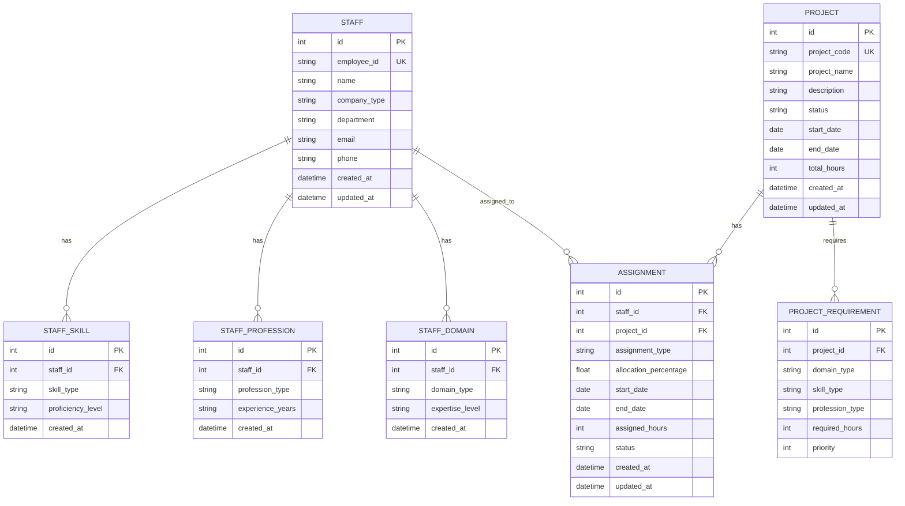

# データベース設計

## ER図

## テーブル詳細

### STAFF（要員）
- 基本情報を管理
- company_type: 'KOBELCO' | 'PARTNER'
- 500名の要員情報を格納

### STAFF_SKILL（要員スキル）
- スキル情報を管理
- skill_type: 'OPEN' | 'HOST'
- proficiency_level: 'BEGINNER' | 'INTERMEDIATE' | 'ADVANCED' | 'EXPERT'

### STAFF_PROFESSION（要員プロフェッション）
- プロフェッション情報を管理
- profession_type: 'EXPERT' | 'PM' | 'DESIGNER' | 'DEVELOPER'
- experience_years: 経験年数

### STAFF_DOMAIN（要員専門領域）
- 専門領域情報を管理
- domain_type: 'PRODUCTION' | 'SALES' | 'PROCUREMENT'
- expertise_level: 'BEGINNER' | 'INTERMEDIATE' | 'ADVANCED' | 'EXPERT'

### PROJECT（案件）
- 案件基本情報を管理
- status: 'PLANNING' | 'ACTIVE' | 'SUSPENDED' | 'COMPLETED'
- 年次計画と年央変更に対応

### PROJECT_REQUIREMENT（案件要件）
- 案件に必要なスキル・専門性を定義
- priority: 1-5（優先度）

### ASSIGNMENT（アサイン）
- 要員と案件のアサイン関係を管理
- assignment_type: 'FULL' | 'PARTIAL'
- allocation_percentage: 0.0-1.0（割合）
- status: 'ACTIVE' | 'INACTIVE' | 'COMPLETED'
