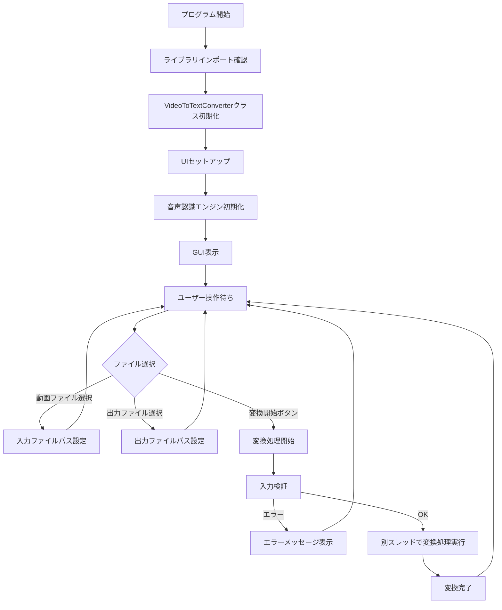
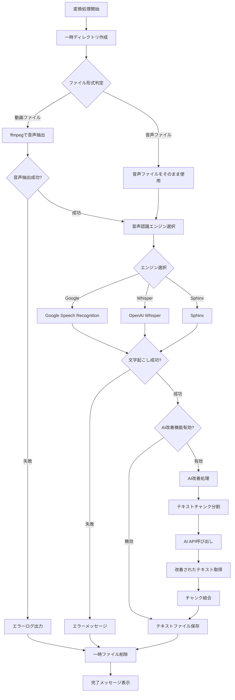
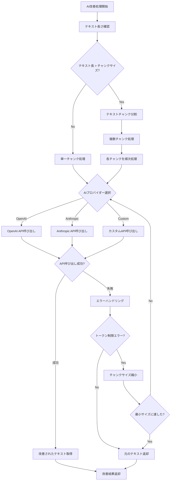
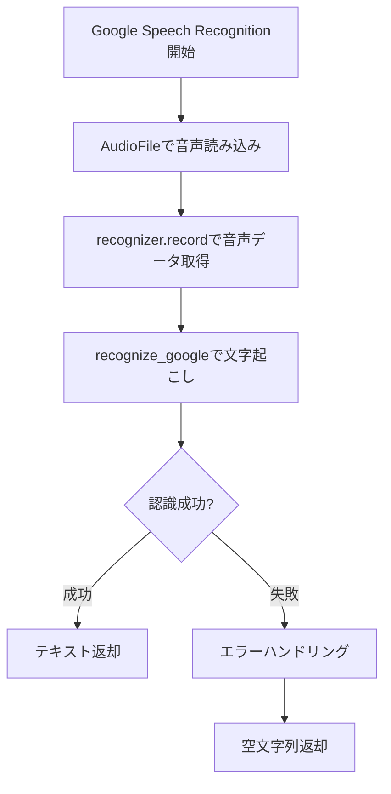
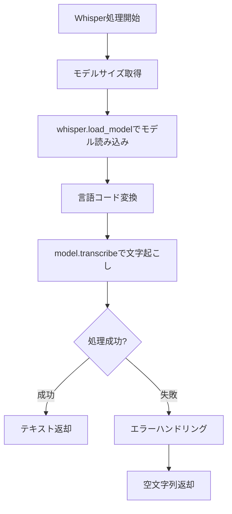
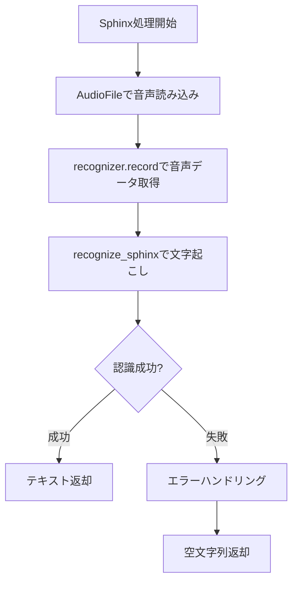
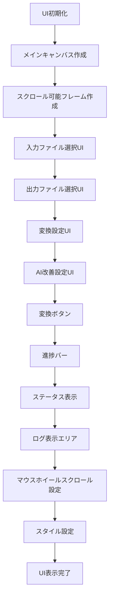
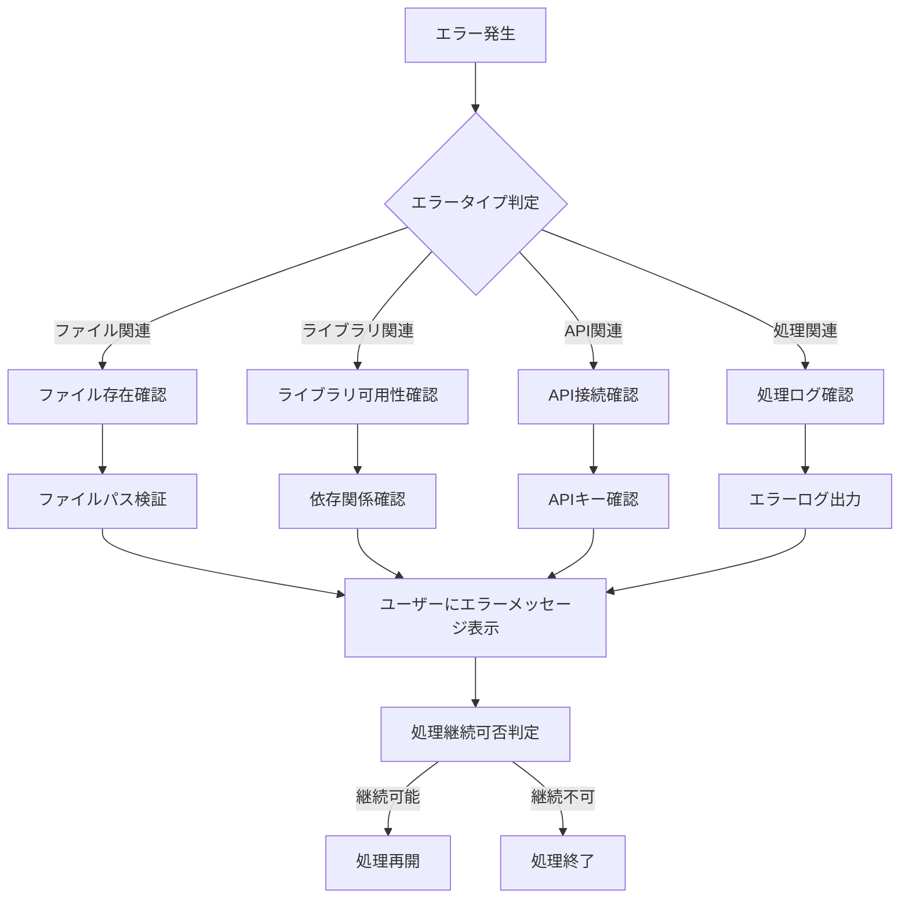
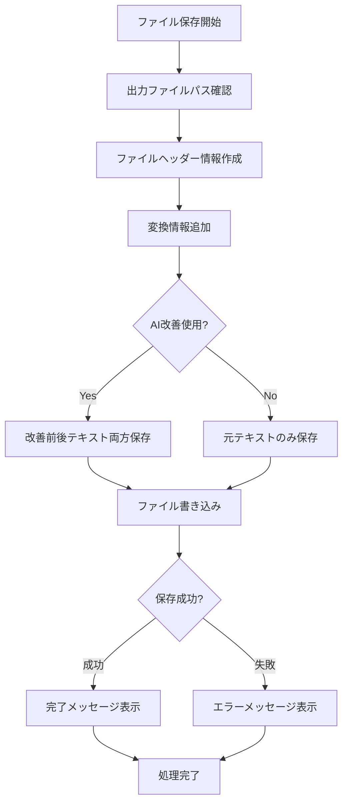

# 動画文字起こしツール プログラムフローチャート

## メインプログラムフロー

## 変換処理フロー

## AI改善処理フロー

## 音声認識エンジン別フロー

### Google Speech Recognition

### OpenAI Whisper

### Sphinx

## UI操作フロー

## エラーハンドリングフロー

## ファイル保存フロー

このフローチャートは、動画文字起こしツールの主要な処理フローを視覚化したものです。各処理の流れと分岐点、エラーハンドリングが明確に示されています。

